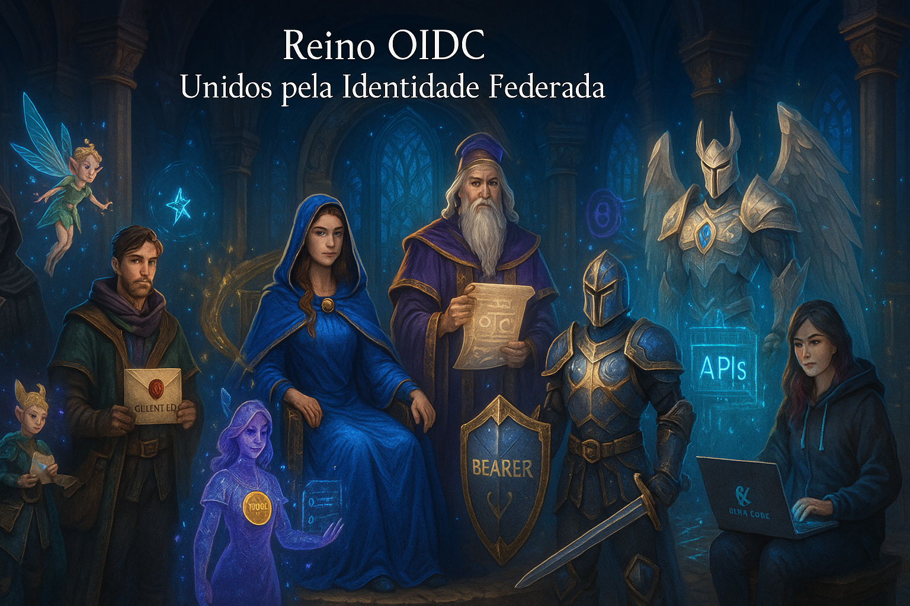

🧩 O Reino da Identidade Federada
Uma aventura pedagógica sobre confiança, tokens e autenticação moderna

[Legenda: Os personagens principais da aventura]

🏰 Contexto da história

Há um grande reino digital chamado Federápolis, onde várias cidades e portais precisam se comunicar com segurança.
Cada portal representa uma empresa, um app ou um serviço conectado.
No coração desse reino está o Conselho da Confiança, guardião das chaves digitais, certificados e tokens.

E cada parte desse ecossistema é representada por um personagem — com personalidade, voz e função.

👑 1. Lady OAuth — A Guardiã das Portas

Título: Dama das Autorizações
Símbolo: Uma chave dourada com selo de permissão
Função: Ela define quem pode entrar e o que pode fazer

Lady OAuth é elegante e justa. Ela nunca pergunta quem você é — apenas se tem permissão para o que está tentando fazer.
Ela é a porta de acesso que separa usuários, clientes e recursos protegidos.

Ela diz:

“Não me importa sua identidade, mas sim o que você tem permissão para acessar.”

Ela entrega Access Tokens aos mensageiros (aplicações clientes), que servem como passes temporários para acessar recursos no reino.

Representa:
→ O protocolo OAuth 2.1, responsável pela autorização (não pela identidade).

🧙‍♂️ 2. Lord OIDC — O Mago da Identidade

Título: Mestre dos Selos de Identidade
Símbolo: Um pergaminho digital com selo azul e assinatura criptográfica
Função: Ele confirma quem é o usuário e assina um ID Token

Lord OIDC trabalha lado a lado com Lady OAuth, mas vai além.
Ele não apenas concede acesso — ele revela a verdade sobre quem está pedindo.

Ele aparece nas integrações com Google, Microsoft e outros “reinos aliados”, e diz:

“Com este token, eu declaro quem é este usuário, e juro pela minha chave pública que isso é verdade.”

Representa:
→ O OpenID Connect, que adiciona autenticação e identidade sobre o OAuth 2.0.

🧑‍💼 3. Alex Client — O Mensageiro Confiável

Título: O Emissário das Aplicações
Símbolo: Um envelope com o selo “Client ID”
Função: Representa o aplicativo que quer acessar dados em nome do usuário.

Alex é o intermediário entre o usuário e os serviços.
Ele não guarda senhas, não lê segredos, mas sabe pedir tokens corretamente.

“Eu sou apenas um mensageiro. Se me derem um código, eu trago o token certo — e nada mais.”

Alex aprende a usar o PKCE (o Protocolo da Chave Secreta Temporária) para proteger suas mensagens.
Ele é disciplinado: só troca códigos por tokens se tiver a prova correta.

Representa:
→ O Cliente OAuth/OIDC, ou seja, o aplicativo que consome os tokens.

🧚 4. Pixie PKCE — A Guardiã dos Códigos Secretos

Título: Espírito da Confirmação Criptográfica
Símbolo: Um fio de luz conectando duas chaves
Função: Garante que o código de autorização só pode ser usado por quem o gerou.

Pixie é uma entidade de luz que acompanha Alex em cada viagem entre portais.
Ela cria uma chave secreta efêmera (code_verifier) e um desafio criptográfico (code_challenge) antes de cada jornada.

Quando o código volta, ela sussurra:

“Sem mim, qualquer um poderia roubar esse código no caminho. Mas só quem conhece o segredo pode completar a troca.”

Representa:
→ O Proof Key for Code Exchange (PKCE) — mecanismo de segurança obrigatório no OAuth 2.1.

🧝‍♀️ 5. IDA Token — A Mensageira da Verdade

Título: Arauto da Identidade
Símbolo: Um medalhão com o nome e assinatura digital do usuário
Função: Transmite quem o usuário é, de forma segura e verificável.

IDA (ID Token) é rápida e precisa.
Ela traz informações essenciais — nome, e-mail, ID único — e uma assinatura digital (JWKS) que garante sua autenticidade.

“Sou a verdade assinada por Lord OIDC. Quem me lê sabe quem é o usuário, sem jamais ver sua senha.”

Representa:
→ O ID Token do OIDC, que identifica o usuário autenticado.

🛡️ 6. Ace Token — O Guerreiro das Permissões

Título: Cavaleiro da Autorização
Símbolo: Um escudo com o nome “Bearer”
Função: Dá acesso a recursos protegidos.

Ace é o irmão de IDA. Enquanto ela prova quem o usuário é, ele prova que o cliente tem autorização.

“Sou o Access Token — temporário, poderoso e perigoso nas mãos erradas.”

Ele expira rapidamente e deve ser usado com cuidado.
Seu lema é: “Acesso concedido, não eterno.”

Representa:
→ O Access Token, usado para autorizar requisições em APIs (Resource Servers).

🏦 7. Seraph Resource — O Guardião dos Dados

Título: O Protetor das APIs
Símbolo: Uma muralha digital com sensores de assinatura JWT
Função: Entregar dados apenas a quem tem tokens válidos.

Seraph é um guerreiro antigo e firme.
Ele verifica cada token, confirma assinaturas, expirações e escopos antes de liberar dados.

“Não importa quem pede. Importa se o token é legítimo e ainda válido.”

Representa:
→ O Resource Server, que hospeda dados e APIs protegidas.

👩‍💻 8. Devia — A Aprendiz de Integradora

Título: A Desenvolvedora da Cara Core
Símbolo: Um laptop com o logotipo “Cara Core Informática”
Função: Ela aprende a conectar todos esses personagens num sistema real.

Devia está em treinamento.
Ela entende que implementar OAuth 2.1 e OIDC não é decorar código, mas entender a diplomacia do Reino da Confiança:

“Cada parte do protocolo é um personagem com papel definido.
O segredo é fazê-los conversar em harmonia.”

🧭 A Jornada da Aprendiz (Resumo narrativo do fluxo)

Devia (a desenvolvedora) pede ajuda a Lady OAuth para permitir que Alex (o Cliente) acesse recursos.

Pixie PKCE cria o código secreto temporário para evitar roubos.

Alex leva o código até Lord OIDC, que autentica o usuário e devolve os tokens.

IDA Token e Ace Token viajam juntos: uma prova de identidade e uma de permissão.

Seraph Resource valida os tokens antes de abrir os portões dos dados.

Tudo é registrado no Livro da Confiança — um log criptográfico assinado.

Devia entende que a verdadeira magia está na validação, expiração e assinatura — não em senhas.

💡 Lições técnicas que a metáfora ensina
Personagem	Representa	Conceito técnico
Lady OAuth	Protocolo OAuth 2.1	Autorização entre sistemas
Lord OIDC	Extensão OpenID Connect	Autenticação e identidade
Alex Client	Aplicação cliente	Responsável por iniciar o fluxo
Pixie PKCE	Proof Key for Code Exchange	Proteção contra interceptação
IDA Token	ID Token	Identidade assinada digitalmente
Ace Token	Access Token	Permissão de acesso
Seraph Resource	Resource Server	Servidor de dados protegidos
Devia (você)	Desenvolvedor	Integra tudo com segurança
🪶 Epílogo: A Frase do Conselho da Confiança

“Nenhuma senha é mais poderosa que a confiança construída entre identidades, permissões e provas criptográficas.”